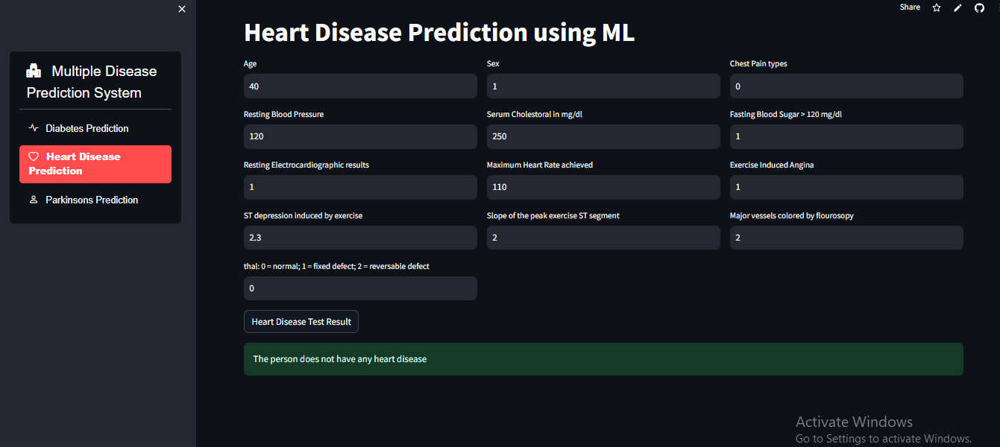
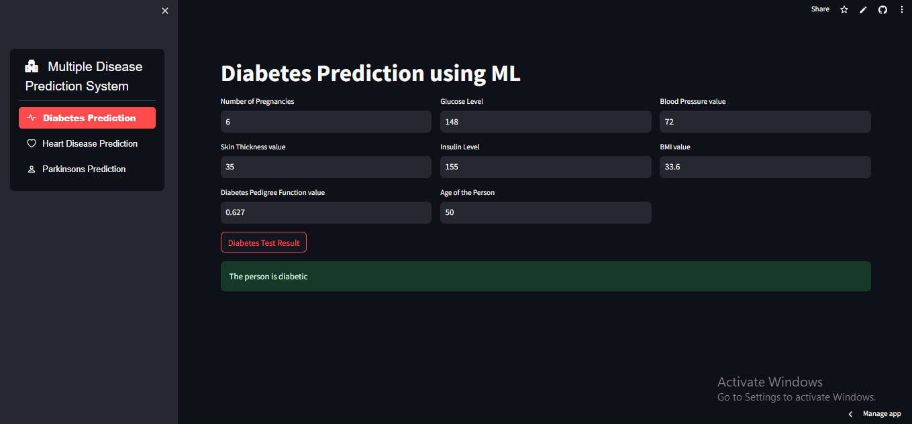
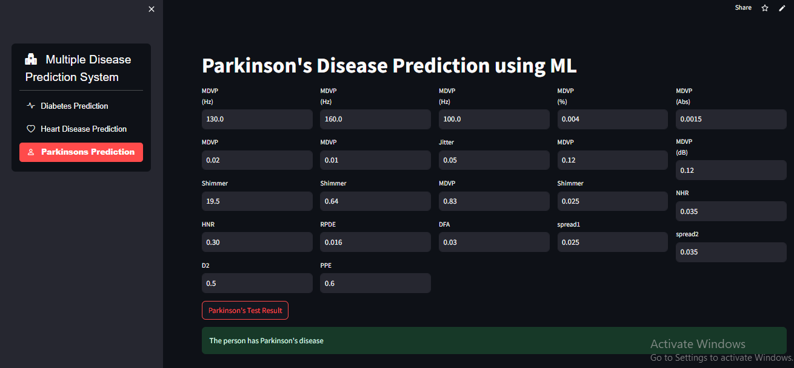

# Multiple Disease Prediction System using Machine Learning and OpenVINO

🌐 Live Demo
👉 Try it live on Streamlit Cloud:https://intelmultiplediseasepredict.streamlit.app/


## 🔬 Overview

This project is a web-based application designed to predict the likelihood of three major health conditions using machine learning:

- **Heart Disease**
- **Diabetes**
- **Parkinson's Disease**

The app is built using **Streamlit** for the frontend and includes optimized machine learning models using **OpenVINO™** to boost inference performance and deployability on Intel-based systems.

---

## 🧠 Models Used

Each disease prediction model was trained using respective healthcare datasets:

- `heart_disease_model.pkl`: Trained on UCI Heart Disease dataset.
- `diabetes_model.pkl`: Trained on PIMA Indian Diabetes dataset.
- `parkinsons_model.pkl`: Trained on Parkinson’s Telemonitoring dataset.

All models were trained using traditional ML algorithms like Logistic Regression, SVM, and Random Forest.

---

## ⚡ OpenVINO Optimization

To enhance performance, we converted our original models into the **OpenVINO™ Intermediate Representation (IR)** format consisting of:
- `.xml` (model structure)
- `.bin` (model weights)

This conversion enables **hardware-accelerated inference** on Intel CPUs and integrated GPUs.

### ✔ Benefits of Using OpenVINO:
- Faster inference time
- Reduced latency
- Efficient edge deployment
- Optimized for Intel hardware

---

## 🏗️ Project Structure

multiple-disease-prediction-app/
│
├── models/
│ ├── heart_disease_model.onnx
│ ├── diabetes_model.onnx
│ ├── parkinsons_model.onnx
│ ├── heart_disease_model.xml
│ ├── heart_disease_model.bin
│ ├── diabetes_model.xml
│ ├── diabetes_model.bin
│ ├── parkinsons_model.xml
│ ├── parkinsons_model.bin
│
├── app.py
├── requirements.txt
├── README.md
└── ...


---

## 🚀 How to Run the Application

### 1. Clone the Repository
```bash
git clone https://github.com/yourusername/multiple-disease-prediction-app.git
cd multiple-disease-prediction-app

2. Install Dependencies

pip install -r requirements.txt

3. Run the App

streamlit run app.py

 Step 1: Convert .pkl to .onnx
Convert your sklearn model to ONNX format using skl2onnx or onnxmltools.

# Example for Heart Disease
from sklearn.linear_model import LogisticRegression
import pickle
from skl2onnx import convert_sklearn
from skl2onnx.common.data_types import FloatTensorType

model = pickle.load(open('heart_disease_model.pkl', 'rb'))
initial_type = [('float_input', FloatTensorType([None, 13]))]
onnx_model = convert_sklearn(model, initial_types=initial_type)
with open("heart_disease_model.onnx", "wb") as f:
    f.write(onnx_model.SerializeToString())

Step 2: Convert ONNX to OpenVINO IR
ovc heart_disease_model.onnx
This will generate:

. heart_disease_model.xml

. heart_disease_model.bin

Repeat this for other models (diabetes, parkinson).


## 💉 Heart Disease Prediction



The model analyzes patient data and outputs a prediction on the likelihood of heart disease.

## 🧠 Parkinson’s Disease Prediction



This section uses voice and movement-related data to assess whether a patient may have Parkinson’s Disease.

## 🍬 Diabetes Prediction



By evaluating key health indicators like glucose level and BMI, the model predicts diabetes risk.


💡 Future Improvements
Integrate deep learning models with CNNs

Add real-time data input from sensors

Deploy as a mobile-friendly web app

🙋‍♂️ Acknowledgements
. Intel® OpenVINO™ Toolkit

. Streamlit

. UCI Machine Learning Repository

